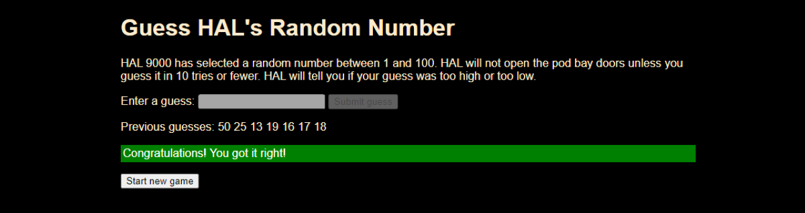

# Guess HAL's Random Number
A random number guessing game made from instructions in the MDN JavaScript course at https://developer.mozilla.org/

Click <a href="https://gavin867.github.io/Guess_HALs_Random_Number/" target="_blank" title="Play the game!">here</a> or copy and paste <a href="https://gavin867.github.io/Guess_HALs_Random_Number/" target="_blank" title="Play the game!">https://gavin867.github.io/Guess_HALs_Random_Number/</a> into your browser to play.

